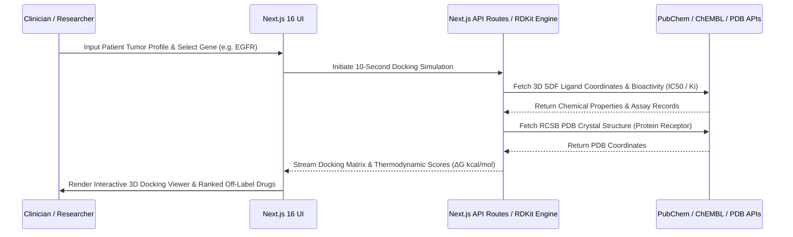

# OncoTarget-X: AI Precision Oncology & Drug Repurposing Platform

## Executive Summary

Traditional molecular docking pipelines and drug discovery cycles take over 10 years and billions of dollars, often stalling on high-performance computing (HPC) clusters. **OncoTarget-X** bridges this gap by leveraging lightweight pre-computed binding affinity models, live biomedical APIs (PubChem, ChEMBL, RCSB PDB), and WebGL visualization to render actionable therapeutic insights in under 10 seconds.

---

## 🏛️ System Architecture & Data Flow

---

## 🔬 Core Components & Modules

### 1. Biomarker Input & Ingestion (`app/components/LandingHero.tsx`)
- Accepts patient tumor RNA-Seq matrices, VCF variant files, or custom FASTA sequences.
- Dynamic biomarker selector supporting `EGFR`, `BRAF`, `TP53`, `KRAS`, and `ALK`.

### 2. WebGL 3D Molecular Docking Engine (`app/components/MolecularViewer.tsx`)
- Integrates **3Dmol.js** to render protein-ligand complexes.
- Real-time switching between `Cartoon`, `Stick`, `Sphere`, and `VDW Surface` rendering modes.
- Automated active-pocket camera focus.

### 3. Ranked Off-Label Repurposing Matrix (`app/components/DrugTable.tsx`)
- Focuses on approved non-oncology or cross-indication compounds (antifungals, anti-arrhythmics, anti-inflammatories).
- Ranks candidates by thermodynamic binding energy ($ΔG \le -9.0\text{ kcal/mol}$).

### 4. Bioactivity & Analytics (`app/components/ChemblBioactivityCard.tsx` & `ExpressionChart.tsx`)
- Pulls EMBL-EBI ChEMBL assay records ($IC_{50}$, $K_i$).
- Visualizes binding affinity and efficacy distributions.

### 5. Clinical AI Assistant & PDF Reporting (`app/components/GeminiAssistant.tsx` & `PatientReportModal.tsx`)
- Google Gemini-powered clinical reasoning.
- 1-click export of structured patient precision oncology reports.
