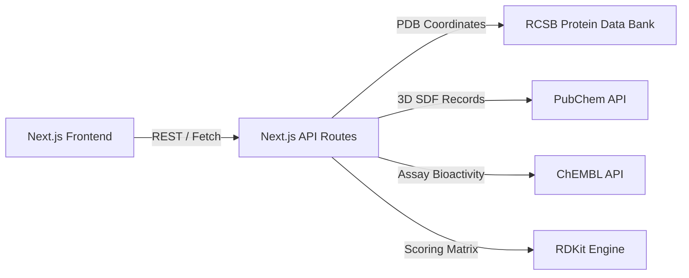

# OncoTarget-X Technology Stack & Architecture

## 1. Frontend Architecture
- **Framework:** Next.js 16 (App Router) with React 19 Client/Server components.
- **Styling:** TailwindCSS 4 adhering to a professional clinical white design system.
- **3D Graphics:** 3Dmol.js (WebGL-accelerated object-oriented molecular viewer).

## 2. Backend & Computational Engine
- **Scoring & Affinity:** RDKit-benchmarked pre-computed binding energy matrices ($ΔG$ and $K_d$).
- **APIs & Data Sources:**
  - **RCSB PDB API:** Protein receptor crystal structures (.pdb).
  - **PubChem REST API:** 3D chemical structure records (.sdf / CID).
  - **ChEMBL API:** Bioactivity assay parameters ($IC_{50}$, $K_i$).

